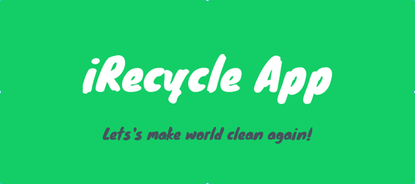
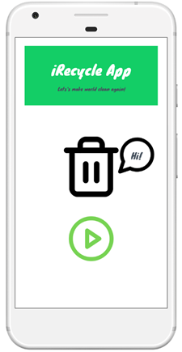
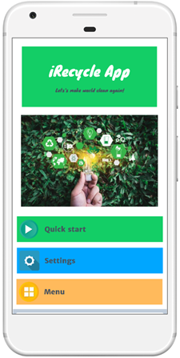
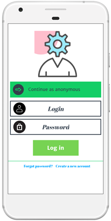
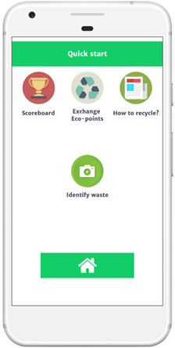
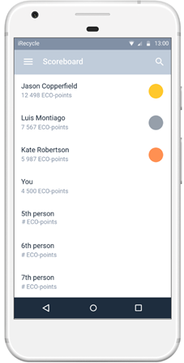
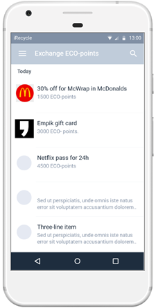
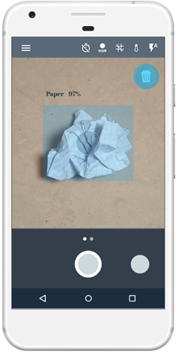
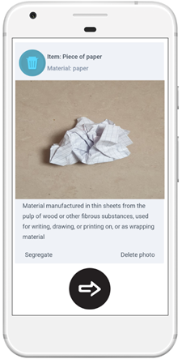

# iRecycle App
> This is a project of an app that is supposed to help people recycle waste correctly. The main idea is to use image recognition and classification models to divide various pieces of trash into plastic, paper, glass and etc. categories.
> Live demo [_here_](https://marvelapp.com/prototype/7j24jcj). <!-- If you have the project hosted somewhere, include the link here. -->
> 

## Table of Contents
* [General Info](#general-information)
* [Technologies Used](#technologies-used)
* [Features](#features)
* [Screenshots](#screenshots)
* [Project Status](#project-status)
* [Room for Improvement](#room-for-improvement)
* [Acknowledgements](#acknowledgements)
* [Contact](#contact)
<!-- * [License](#license) -->

## General Information
- This project intend to solve a problem of increasing at enormous pace stream of waste. Many people have no idea how to properly recycle some products and this application would be some kind of aid in that challenging task.
<!-- You don't have to answer all the questions - just the ones relevant to your project. -->

## Technologies Used
- Prototyping tool - Marvel (marvelapp.com)
- HTML5
- CSS3
- GIMP

## Features
List of planned features:
- Camera AI recognition system.
- Gamification and scoreboard to compete with your friends. You can win attractive prizes, bonuses for frequent recycling your waste.
- Ecology and CSR news embedded in an application.

## Screenshots

<!-- If you have screenshots you'd like to share, include them here. -->

## Project Status
Project is: _no longer being worked on_. Initially it was a project which was being prepared for Enactus Poland 2020. Due to the outbreak of Covid-19 pandemic and the competition being canceled I and my friends abandoned the project as the main motivation and objective hadn't could be met.

## Room for Improvement
These are areas I believe need improvement / could be improved. Also I included TODOs for future development.

Room for improvement:
- Add more intuitive navigation bar.
- Build an alpha android version app.

To do:
- Add navigation bar.
- Implement AI Image recognition module.

## Acknowledgements
- This project was inspired by Enactus Poland.
- This prototype was build on [Marvelapp](https://www.marvelapp.com).
- Many thanks to Michał Szmeja.

## Contact
Created by [@Matimateokol](https://github.com/Matimateokol) - feel free to contact me!

<!-- Optional -->
<!-- ## License -->
<!-- This project is open source and available under the [... License](). -->

<!-- You don't have to include all sections - just the one's relevant to your project -->
